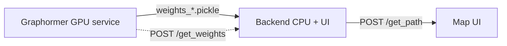

# План документации TransTTE на Hugo-book

Документ-план для реализации сайта документации из нового чата. Тема: [alex-shpak/hugo-book](https://github.com/alex-shpak/hugo-book).
Референс по содержанию: статья PKDD'22 «Logistics, Graphs, and Transformers» ([docs/reference/2207.05835v1.pdf](reference/2207.05835v1.pdf), arXiv:2207.05835).

Цель сайта — рассказать про **исследование**, **архитектуру**, **как запустить** и **как проходило обучение**.

---

## 0. Решения, которые надо принять до старта

| Вопрос | Рекомендация | Причина |
|--------|--------------|---------|
| Язык контента | **Английский** | Статья, README и код — на английском; проще для внешней аудитории. Русский — если аудитория внутренняя. |
| Где живёт сайт | Отдельная папка `docs/site/` (Hugo-проект внутри репо) | Не мешается с `docs/reference/`. Исходный PDF остаётся в `docs/reference/`. |
| Хостинг | **GitHub Pages** через GitHub Actions | Бесплатно, деплой по push в `main`. Альтернатива: Netlify. |
| Установка темы | **git submodule** `themes/hugo-book` | Проще всего; альтернатива — Hugo Modules. |
| Формулы | **KaTeX** (в теме есть partial `math`) | В статье есть формулы (centrality/spatial encoding, attention bias, вес для Dijkstra). |
| Диаграммы | **Mermaid** (встроен в hugo-book) | Для схемы двух-сервисной архитектуры. |

> Всё ниже написано под рекомендованные варианты. Если аудитория внутренняя — переключить контент на русский, структура не меняется.

---

## 1. Предварительные требования

- **Hugo Extended** (не обычный!) — минимум v0.112+. Тема требует extended-версию из-за SCSS.
  - macOS: `brew install hugo`
  - проверить: `hugo version` → строка должна содержать `extended`.
- Git (для submodule).
- Node не нужен (flexsearch-поиск и KaTeX идут ассетами темы).

---

## 2. Инициализация проекта (пошагово)

```bash
# из корня репозитория
hugo new site docs/site --format toml
cd docs/site

# тема как submodule
git submodule add https://github.com/alex-shpak/hugo-book themes/hugo-book

# базовый конфиг (см. раздел 3)
# затем структура контента (см. раздел 4)
hugo server -D   # локальный предпросмотр на http://localhost:1313
```

> Примечание: `hugo new site` создаст `docs/site/`. `.gitignore` в корне репо уже большой — добавить в него `docs/site/public/` и `docs/site/resources/_gen/` (кэш Hugo), чтобы не коммитить сборку.

---

## 3. Конфигурация `docs/site/hugo.toml`

```toml
baseURL = 'https://<username>.github.io/TransTTE/'   # поправить под реальный репо/домен
title = 'TransTTE'
theme = 'hugo-book'

# hugo-book строит левое меню из дерева content/docs
[params]
  BookTheme = 'auto'          # light/dark/auto
  BookToC = true              # оглавление справа
  BookRepo = 'https://github.com/Vloods/TransTTE_demo'   # ссылка "Edit this page"
  BookEditPath = 'edit/main/docs/site/content'
  BookSearch = true
  BookComments = false

# KaTeX + Mermaid включаются per-page через front matter (bookMath / mermaid),
# либо глобально — см. раздел 7.

[markup]
  [markup.goldmark.renderer]
    unsafe = true             # нужно для inline-HTML (таблицы из README, картинки)
  [markup.tableOfContents]
    startLevel = 1
    endLevel = 3
```

Ключевые особенности темы (запомнить при вёрстке):
- Левое меню = дерево файлов в `content/docs/`. Порядок — через `weight` во front matter.
- `_index.md` в папке = страница-раздел; `bookCollapseSection: true` — сворачиваемый раздел.
- `bookFlatSection: true` — сделать раздел «плоским» заголовком группы.
- `bookHidden: true` — скрыть из меню.
- Главная страница — `content/_index.md` (это НЕ часть меню docs).

---

## 4. Структура контента (карта сайта)

```
docs/site/content/
├── _index.md                      # Лендинг: что такое TransTTE, картинка пайплайна, быстрые ссылки
└── docs/
    ├── _index.md                  # Корень документации (weight 1, редирект/оглавление)
    │
    ├── introduction/
    │   └── _index.md              # weight 1 — Проблема TTE/ETA, вклад работы, ссылка на статью
    │
    ├── research/                  # weight 2 — ИССЛЕДОВАНИЕ
    │   ├── _index.md              #   Обзор раздела
    │   ├── problem-formulation.md #   Формальная постановка задачи (origin, destination, departure time)
    │   ├── related-work.md        #   Два класса методов TTE; бейзлайны GBDT/MURAT/WDR
    │   ├── method.md              #   Graphormer: centrality/spatial encoding, attention bias (KaTeX)
    │   └── results.md             #   Таблица 1 (MAE/RMSE), метрики picturesqueness/historicity, вывод
    │
    ├── architecture/             # weight 3 — АРХИТЕКТУРА
    │   ├── _index.md              #   Обзор двух-сервисной схемы + Mermaid-диаграмма
    │   ├── graphormer-service.md  #   GPU-сервис: /get_weights, веса на ребро
    │   ├── backend-service.md     #   CPU-сервис + UI: /get_path, BallTree, igraph
    │   ├── weight-contract.md     #   Контракт передачи весов через pickle (порядок рёбер!)
    │   ├── eta-paths.md           #   Два способа ETA: нейросеть (FFNet) vs взвешенная сумма
    │   └── routing-objectives.md  #   dist/green/hist/safety/beauty — как добавить objective
    │
    ├── datasets/                 # weight 4 — ДАННЫЕ
    │   └── _index.md              #   Abakan/Omsk: узлы/рёбра, статистика поездок, фичи, фильтрация
    │
    ├── training/                 # weight 5 — ОБУЧЕНИЕ
    │   ├── _index.md              #   Как обучали: fairseq, GraphormerSLIM (L=12,d=80), AdamW, железо, время
    │   └── data-preparation.md    #   Препроцессинг: graph_preprocessing, фичи, node-эмбеддинги (DGI+GraphSAGE)
    │
    ├── running/                  # weight 6 — КАК ЗАПУСТИТЬ
    │   ├── _index.md              #   Prerequisites, обзор через Docker
    │   ├── backend.md             #   Сборка/запуск visual-контейнера
    │   ├── graphormer.md          #   Сборка/запуск graphormer, вызов /get_weights
    │   └── data-assets.md         #   Что скачать (Yandex.Disk), куда положить, что ломается при отсутствии
    │
    └── reference/                # weight 7 — СПРАВОЧНИК
        ├── api.md                 #   Эндпоинты /get_path, /get_weights, форматы запрос/ответ
        └── glossary.md            #   Термины: TTE, ETA, edge weight, centrality encoding и т.д.
```

Каждый файл-контент начинается с front matter:
```yaml
---
title: "Method"
weight: 3
bookToc: true
# math: true      # включить KaTeX на странице (см. раздел 7)
---
```

---

## 5. Что писать на каждой странице (источники контента)

### 5.1 `_index.md` (лендинг)
- Одно-двух-абзацный питч из README ([README.md:6](../README.md)) + картинка пайплайна.
- Картинки уже есть: [resources/transtte_pipeline_wh.png](../resources/transtte_pipeline_wh.png) (light) и [resources/transtte_pipeline_bl.png](../resources/transtte_pipeline_bl.png) (dark). Скопировать в `docs/site/static/images/`.
- Кнопки-ссылки: «Исследование», «Архитектура», «Запуск», arXiv, живое демо transtte.online.

### 5.2 Introduction — источник: статья §1 (paper.txt строки 33–53)
- Проблема: рост транспорта → ETA/TTE как ключевая задача; сложность из-за структуры дорожной сети.
- Три вклада работы: (1) модель TransTTE на трансформере, (2) новый датасет Omsk, (3) веб-сервис.
- Ссылки: arXiv, репозиторий, демо.

### 5.3 Research → problem-formulation — статья §3 «Task» (строки 71–72)
- Дано: origin, destination, departure time. Задача: оценить длительность поездки по историческому датасету X и дорожному графу G.

### 5.4 Research → related-work — статья §2 (строки 56–64) + §4 (бейзлайны)
- Два класса методов TTE: посегментный (не ловит глобальные свойства пути) vs путь-целиком.
- Бейзлайны для сравнения: **GBDT**, **MURAT** (DeepWalk + residual FF), **WDR** (GLM + LSTM).

### 5.5 Research → method — статья §3 «Model» (строки 73–89). **Нужен KaTeX.**
- Почему трансформер для графов; база — **Graphormer** [8].
- **Centrality encoding**: $h_i^{(0)} = x_i + z^-_{\deg^-(v_i)} + z^+_{\deg^+(v_i)}$.
- **Spatial encoding**: $\phi(v_i, v_j)$ — кратчайшее расстояние между узлами как bias.
- **Attention bias**: $A_{ij} = \frac{(h_i W_Q)(h_j W_K)^T}{\sqrt{d}} + b_{\phi(v_i,v_j)}$.
- Реализация в репо: [graphormer/app/graphormer_repo/graphormer/models/graphormer.py](../graphormer/app/graphormer_repo/graphormer/models/graphormer.py).

### 5.6 Research → results — статья §4 + Таблица 1 (строки 110–148)
- Таблица MAE/RMSE (train/test) для Omsk и Abakan: GBDT / MURAT / WDR / **TransTTE**. TransTTE лучший по MAE.
- Дополнительные objective: **picturesqueness** и **historicity** через OpenStreetMap API; вес сегмента $W_i = \frac{1}{1+C_r}$, где $C_r$ — число объектов в радиусе $r$.
- Ускорение обучения ~10× за счёт кэширования spatial encoding.

### 5.7 Architecture (весь раздел) — источник: [CLAUDE.md](../CLAUDE.md) + код
- `_index.md`: Mermaid-диаграмма двух сервисов и pickle-хэндофф.
- graphormer-service: [graphormer/app/app.py](../graphormer/app/app.py), `POST /get_weights` → `{'abakan':[...], 'omsk':[...]}`.
- backend-service: [backend/app/app.py](../backend/app/app.py), `check_town` (bounding-box), BallTree (haversine), igraph `get_shortest_paths`.
- weight-contract: pickle `weights_abakan.pickle`/`weights_omsk.pickle`; **порядок весов == порядок рёбер графа** (нельзя переставлять независимо).
- eta-paths: (1) нейро-ETA `ETAInf.forward` + `FFNet` (152 входа, [backend/app/ml.py](../backend/app/ml.py), [backend/app/eta_inference.py](../backend/app/eta_inference.py)) — Abakan non-graphormer; (2) взвешенная сумма `get_shortest_path_grph` ([backend/app/dijkstra_inference.py](../backend/app/dijkstra_inference.py)) — Omsk + graphormer variant.
- routing-objectives: добавить objective = положить новый `*.pkl` в `data/weights_{city}/`, он сам появится как `type` в ответе `/get_path`.

Пример Mermaid-диаграммы для `architecture/_index.md`:


### 5.8 Datasets — источник: README таблицы ([README.md:73-97](../README.md)) + статья §3 «Data»
- Abakan: 65 524 узла / 340 012 рёбер; Omsk: 231 688 / 1 149 492.
- Поездки: числа, coverage, среднее время/длина.
- Сбор: месяц с 1 дек 2020; фильтрация по rebuild count, min/max длине, суммарному времени.
- Два таргета: реальное время в пути и реальная длина.

### 5.9 Training — источник: статья §4 (строки 119–132) + код
- Фреймворк: **fairseq** (source-build через [graphormer/app/install.sh](../graphormer/app/install.sh)).
- Лучшая конфигурация: **Graphormer-SLIM** ($L=12$, $d=80$), оптимизатор **AdamW** [4].
- Железо: 5× Tesla V100, 460 GB RAM.
- Время обучения TransTTE: 2.5–5 ч (быстрее WDR 7 ч и MURAT 5.5 ч).
- data-preparation: ноутбуки [preprocessing/graph_preprocessing.ipynb](../preprocessing/graph_preprocessing.ipynb), [preprocessing/ETA_additional_features_processing.ipynb](../preprocessing/ETA_additional_features_processing.ipynb); node-эмбеддинги DGI+GraphSAGE ([algorithms/stellar_deepgraphinfomax-graphsage.ipynb](../algorithms/stellar_deepgraphinfomax-graphsage.ipynb)) → `dgi_*` CSV для backend.
- Регистрация графов как PyG-датасетов: `mydata_abakan.py`, `mydata_omsk.py`; сборка объектов — [graphormer/app/data_class.py](../graphormer/app/data_class.py); eval-итератор — [graphormer/app/evaluate_points.py](../graphormer/app/evaluate_points.py).

> ⚠️ В репо нет явного train-скрипта (обучение шло через fairseq CLI). В доке честно отметить, что публикуются чекпоинты + eval-пайплайн; обучение воспроизводится через fairseq `graphormer/app/graphormer_repo`.

### 5.10 Running — источник: [README.md:47-71](../README.md) + [CLAUDE.md](../CLAUDE.md)
- prerequisites: версии пакетов (backend / model), Docker.
- backend.md: `docker build . -t visual` → `docker run --rm -it -p 80:80 visual` → http://127.0.0.1:80/.
- graphormer.md: `docker build . -t graphormer` → run → python-скрипт `requests.post(.../get_weights)`.
- data-assets.md: [backend data (Yandex.Disk)](https://disk.yandex.ru/d/NHj3ukteUGn-dA) → `backend/app/data`; [graphormer models](https://disk.yandex.ru/d/rQCIJs_7Q7Li6g) → `graphormer/app/models`. Отметить gotcha: реальный bind всегда порт 80, хотя Dockerfile `EXPOSE 3006`, а `settings.py` называет другие порты.

### 5.11 Reference
- api.md: тела запросов/ответов. `/get_path` вход `{start_lat,start_lon,end_lat,end_lon}` (координаты всегда lat,lon!), выход — маршрут+ETA на каждый `type`. `/get_weights` — без тела, ответ dict со списками float.
- glossary.md: TTE, ETA, edge weight, centrality/spatial encoding, objective, BallTree, Graphormer.

---

## 6. Ассеты

- Скопировать `resources/transtte_pipeline_{wh,bl}.png` → `docs/site/static/images/`.
- (Опционально) вынести Таблицу 1 и статистику датасетов как Markdown-таблицы (уже есть в README, готовы к переносу).
- (Опционально) скриншот интерфейса демо (Figure 1 в статье, стр. 3) — либо сделать свой с transtte.online.
- Ссылку на PDF статьи оставить на `docs/reference/2207.05835v1.pdf` (или залить копию в `static/`).

---

## 7. Математика (KaTeX) и Mermaid

hugo-book:
- **Mermaid** работает «из коробки»: fenced-блок ```` ```mermaid ````. Для страниц с диаграммами добавить `mermaid: true` во front matter (в новых версиях темы — автодетект).
- **KaTeX**: тема содержит partial. Включить на странице через front matter (в актуальной версии — `math: true`) ИЛИ добавить глобальный partial `layouts/partials/docs/inject/head.html` со стандартным сниппетом KaTeX из документации hugo-book (README темы, секция «KaTeX»). На старте — проверить актуальный способ в README текущей версии темы, т.к. флаг менялся между релизами.

---

## 8. Деплой на GitHub Pages

Файл `.github/workflows/hugo.yml`:
```yaml
name: Deploy Hugo docs
on:
  push:
    branches: [main]
    paths: ['docs/site/**', '.github/workflows/hugo.yml']
permissions:
  contents: read
  pages: write
  id-token: write
jobs:
  build:
    runs-on: ubuntu-latest
    steps:
      - uses: actions/checkout@v4
        with: { submodules: recursive }        # важно: подтянуть тему
      - uses: peaceiris/actions-hugo@v3
        with: { hugo-version: 'latest', extended: true }
      - run: hugo --minify --source docs/site
      - uses: actions/upload-pages-artifact@v3
        with: { path: docs/site/public }
  deploy:
    needs: build
    runs-on: ubuntu-latest
    environment: { name: github-pages }
    steps:
      - uses: actions/deploy-pages@v4
```
- В настройках репо: Settings → Pages → Source = **GitHub Actions**.
- `baseURL` в `hugo.toml` должен совпадать с URL Pages (`https://<user>.github.io/<repo>/`).

---

## 9. Порядок реализации (чек-лист для нового чата)

1. [ ] Установить Hugo Extended, проверить `hugo version`.
2. [ ] `hugo new site docs/site` + добавить тему submodule.
3. [ ] Написать `hugo.toml` (раздел 3).
4. [ ] Создать дерево `content/` (раздел 4) — пустые файлы с front matter.
5. [ ] Наполнить `_index.md` + Introduction + Research (приоритет — это ядро).
6. [ ] Architecture (+ Mermaid-диаграмма) и Datasets.
7. [ ] Training и Running.
8. [ ] Reference (API, glossary).
9. [ ] Скопировать ассеты, проверить KaTeX/Mermaid локально (`hugo server`).
10. [ ] Добавить GitHub Actions workflow, включить Pages.
11. [ ] Обновить корневой [README.md](../README.md): ссылка на опубликованный сайт документации.
12. [ ] Дополнить `.gitignore`: `docs/site/public/`, `docs/site/resources/_gen/`.

---

## 10. Быстрая справка по фактам из статьи (чтобы не перечитывать PDF)

- Авторы: Semenova, Porvatov, Tishin, Sosedka, Zamkovoy (Sberbank / AIRI / MISIS).
- Конференция: PKDD'22. arXiv:2207.05835v1, 12 Jul 2022.
- Метрики TransTTE (test): Omsk MAE 105.464 / RMSE 261.103; Abakan MAE 83.616 / RMSE 168.421 — лучше всех бейзлайнов по MAE.
- Формула веса objective: $W_i = 1/(1+C_r)$.
- Ускорение обучения ~10× (кэш spatial encoding). Конфиг Graphormer-SLIM $L=12, d=80$, AdamW.
