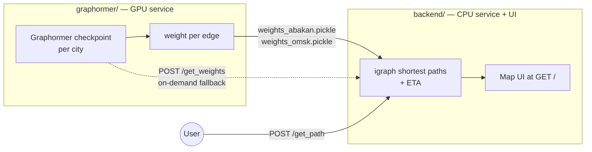

# Architecture

TransTTE ships as a **two-service pipeline**. A Graphormer model turns a city road graph
into one travel-time weight per edge; a backend uses those weights to run shortest-path
routing and serve the map UI.

## The two services

| | [Graphormer service]() | [Backend service]() |
|--|--|--|
| Role | Produce per-edge travel-time weights | Route + ETA + web UI |
| Hardware | GPU | CPU |
| Endpoint | `POST /get_weights` | `POST /get_path`, `GET /` |
| Cost | Expensive, run once | Cheap, per request |

## How they communicate

In normal operation the services do **not** talk over live HTTP. The Graphormer service
runs once, and its per-edge weights are cached as pickle files that the backend loads at
startup. Both `app.py` files carry a `preloaded_weights = True` branch (use the cached
pickles) and an `else` branch (recompute from the model / call the other service) — the
precomputed path is the default.

The ordering of a weights list must line up with the graph's edge order — this is the
[weight-handoff contract](), and it is
the one invariant you can break without getting an error message.

## Read the rest of this section

1. **[Graphormer Service]()** — the
   GPU side and `POST /get_weights`.
2. **[Backend Service]()** — city
   detection, snapping to the graph, and igraph routing.
3. **[Weight Contract]()** — the pickle
   handoff and the edge-order invariant.
4. **[Two ETA Paths]()** — neural ETA vs.
   weighted-sum ETA.
5. **[Routing Objectives]()** — the
   dist/green/hist/… weight variants and how to add one.
