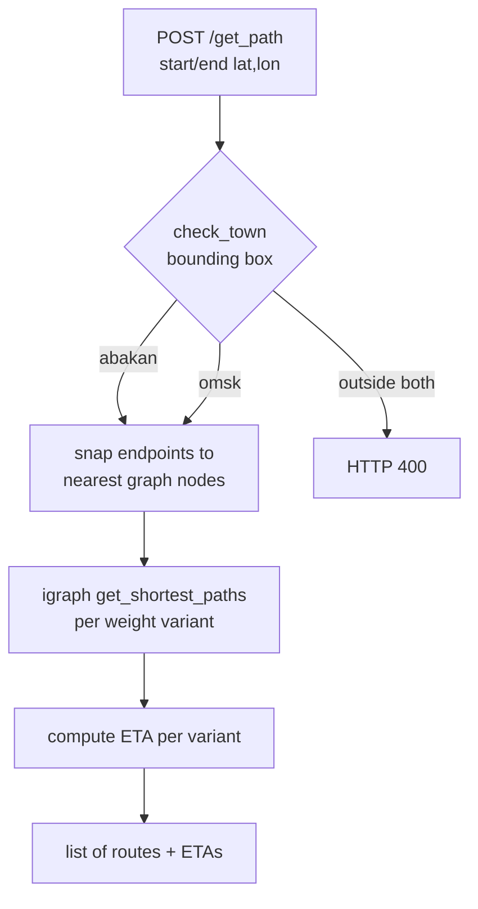

# Backend Service

The backend (`backend/`) is the **CPU side** plus the web UI. It loads the precomputed
edge weights and answers routing requests: given two coordinates, it returns a route and
an ETA for each available [routing objective](). It also serves the interactive map at
`GET /`.

Source:
[`backend/app/app.py`](https://github.com/Vloods/TransTTE_demo/blob/main/backend/app/app.py).

## The endpoint

```text
POST /get_path   body: {start_lat, start_lon, end_lat, end_lon}
                 →     [ {path: [...], eta: <seconds>, type: "<objective>"}, ... ]
GET  /           →     the map UI (index.html)
```

Coordinates in the request body are always `(lat, lon)`. The response is a **list** — one
entry per weight variant, each tagged by its `type`. Endpoint and payload details live in
the [API reference]().

## What a request does



### 1. Pick the city — `check_town`

[`city_bounds.py`](https://github.com/Vloods/TransTTE_demo/blob/main/backend/app/city_bounds.py)
holds a bounding box per city. `check_town` returns `'abakan'` or `'omsk'` only if
**both** endpoints fall inside the same city's box, otherwise `None` → `HTTP 400`. (The
same file is duplicated into the graphormer service, since the two Docker contexts share
no package — keep the copies in sync.)

### 2. Snap to the graph — `BallTree`

Endpoints almost never land exactly on a graph node. `DijkstraPath` builds a
[`BallTree`](https://github.com/Vloods/TransTTE_demo/blob/main/backend/app/dijkstra_inference.py)
over all node coordinates using the **haversine** metric (coordinates converted to
radians) and queries the nearest node for each endpoint.

### 3. Route — igraph, not hand-rolled Dijkstra

Despite the class name, `DijkstraPath` uses **igraph's `get_shortest_paths`** with the
chosen weight list — not a hand-written Dijkstra. It routes once per weight variant loaded
for the city, so a single `/get_path` call returns several alternative routes.

### 4. Compute the ETA

ETA is computed in one of two ways depending on the variant — a neural net for some Abakan
variants, a weighted sum for the rest. That split is important enough to have its own page:
[Two ETA Paths]().

## What it loads at startup

- `dijkstra.pickle` / `graph_omsk.pkl` — the igraph road graphs.
- `clear_nodes*.pkl` — node coordinate tables (used to build the BallTree).
- `SimpleTTE.pth`, `meteoData.csv`, node-embedding CSVs — inputs for the neural ETA.
- `data/weights_{abakan,omsk}/*.pkl` — the non-Graphormer weight variants (each becomes a
  `type`).
- `data/graphormer_weights/weights_*.pickle` — the Graphormer variant.

All of these are large binary assets tracked outside git — see
[Data & Model Assets](). When a load fails, it is
almost always a missing or renamed file under `data/`, not a code bug.
